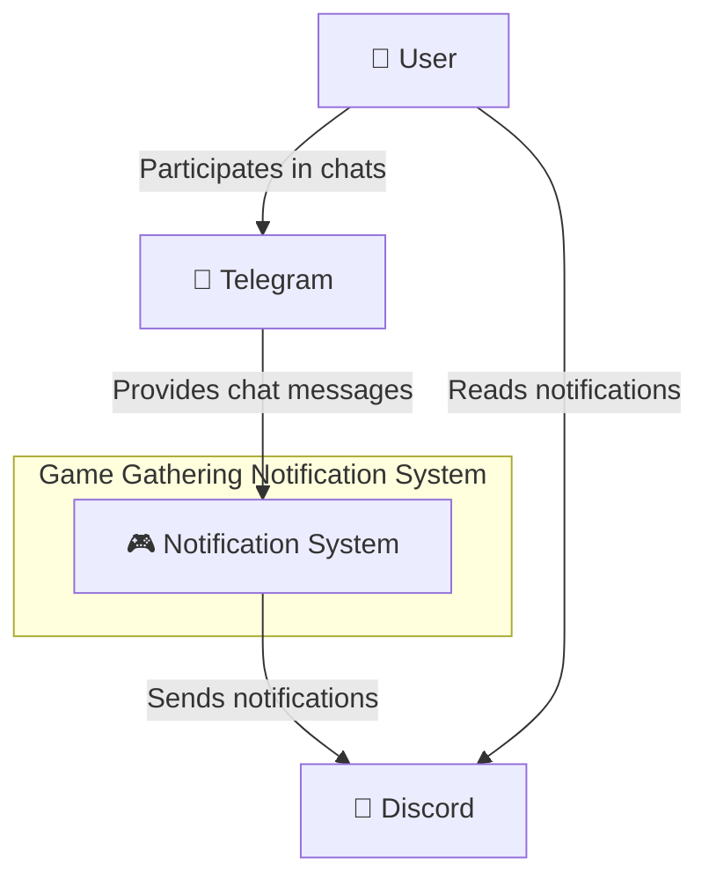
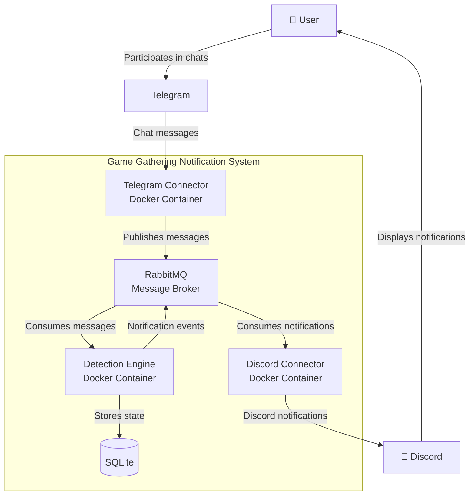
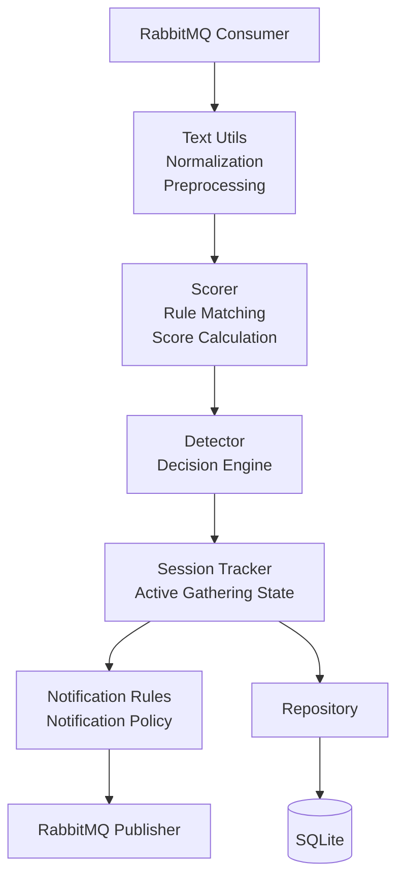

# Problem Statemnets
## **Problem Statement 1** — Пропуск игровых сборов в активном чате
Пользователь состоит в групповом чате Telegram с высокой активностью общения. В чате регулярно появляются предложения собраться для совместной игры, однако из-за большого количества нерелевантных сообщений пользователь не отслеживает чат постоянно и часто пропускает такие приглашения.

## **Problem Statement 2** — Игровые приглашения не имеют фиксированной формы
Участники чата используют неформальный язык и различные формулировки для организации игровых сессий. Приглашения могут выражаться как прямыми призывами («го дота»), так и косвенными сообщениями («есть вайб на майн?», «когда в доту?»). Из-за отсутствия единого шаблона поиск игровых сборов по одному или нескольким ключевым словам недостаточно надежен.

## **Problem Statement 3** — Важность контекста разговора
Отдельное сообщение не всегда позволяет определить факт организации игровой сессии. Часто сбор формируется последовательностью сообщений от нескольких участников, включая приглашение, ответы-согласия, обсуждение времени и подтверждение готовности. Для корректного обнаружения игровых сборов необходимо анализировать контекст диалога и динамику обсуждения во времени.

## **Problem Statement 4** — Необходимость своевременных уведомлений
Даже если приглашение было замечено, пользователь может пропустить последующее развитие обсуждения. В результате возникают ситуации, когда участники уже собирают группу или ожидают игроков, а пользователь узнаёт об этом слишком поздно. Система должна обнаруживать активные игровые сборы и своевременно доставлять уведомления через канал коммуникации, который пользователь отслеживает постоянно (Discord).

## **Problem Statement 5** — Гибкость и адаптируемость правил обнаружения
Тематика игр, стиль общения участников и способы организации игровых сессий со временем меняются. Система должна позволять добавлять новые игры, ключевые слова, паттерны общения и правила оценки сообщений без изменения архитектуры решения, обеспечивая возможность дальнейшего развития и тонкой настройки алгоритмов обнаружения.

# Диаграммы
Диаграммы выполнены для mermaid, код лежит в diagramN.md файлах. Github поддерживает отображение.
## С4 Context

## C4 Container

## C4 Component (Detection engine)

# Сводная таблица
## Анализ результатов генерации ИИ

| Аспект | Что сгенерировал ИИ | Что исправлено вручную | Обоснование исправления |
|--------|---------------------|------------------------|-------------------------|
| С4 Context | нормальную диаграмму, пришлось несколько раз дорасказывать, что делается в mermaid для гитхаба | По сути сам отконтроллировал совместимость. Также исправил LR на TB | Пришлось. Лучше выглядит |
| С4 Container | нормальную диаграмму | - |  |
| С4 Component | нормальную диаграмму? не уверен до конца, что архитектура будет именно такая - но таковы реалии итеративной разработки, уж простите | пока ничего |  |
| Архитектура | Сама архитектура во многом предложена ИИ | Проверял и перенаправлял в нужное русло | И я не сразу все идеально описал, и RabbitMQ добавить хорошая идея, и ИИ сначала хотел очень по-простому сделать |

# Вывод об использовании
Можно использовать.

Подход к работе как и во всем -- ИИ много знает, но за ним нужен глаз да глаз. Как за условным "Junior".

Может совершать ошибки, может недопонимать контекст, лучше всего, я считаю, работу описывает аналогия с, на данный момент уже среднего ума, помощников, который очень быстрый и очень много знает.

За финальный продукт ответсвеннен автор, поэтому проверка и доработка обязательны, но часто могут сводиться к небольшому перенаправлению ИИ.

Качество результата во многом зависит от того, насколько хорошо автор передал задумку ИИ. Все что не описано будет сведено к некоему обще-человеческому среднему, набранному ИИ из интернета -- может быть как хорошо так и не очень.