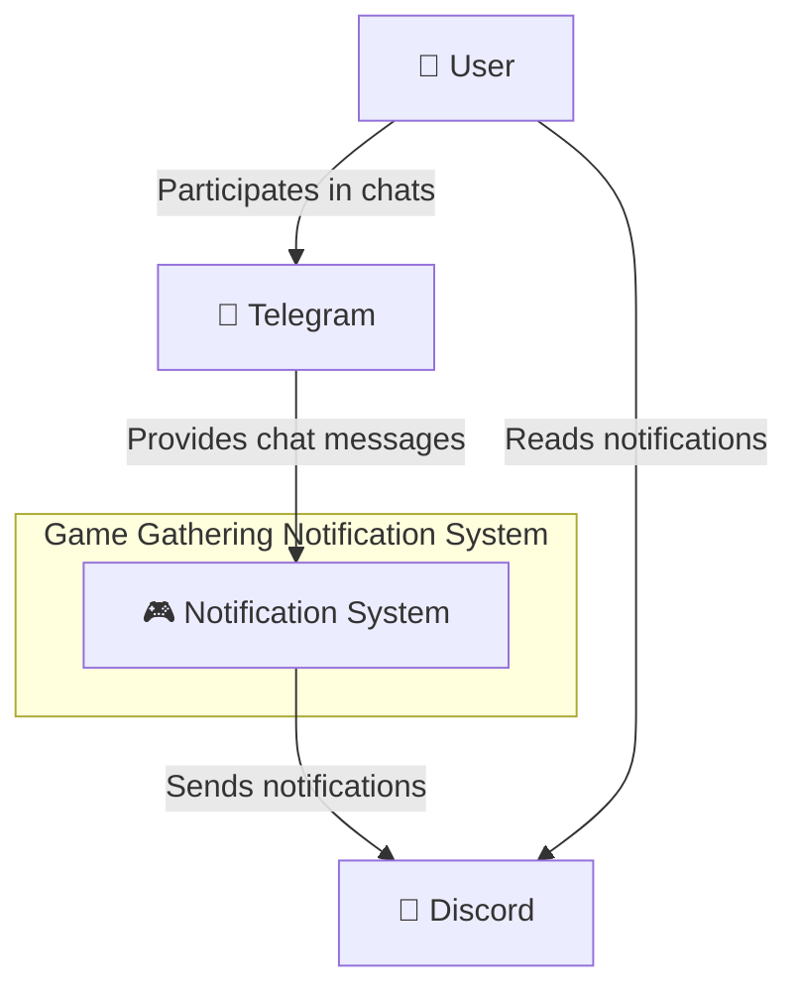

## С4 Context

```mermaid
flowchart TB

    User["👤 User"]

    Telegram["📱 Telegram"]

    subgraph SystemBoundary["Game Gathering Notification System"]
        System["🎮 Notification System"]
    end

    Discord["💬 Discord"]

    User -->|"Participates in chats"| Telegram

    Telegram -->|"Provides chat messages"| System

    System -->|"Sends notifications"| Discord

    User -->|"Reads notifications"| Discord
```