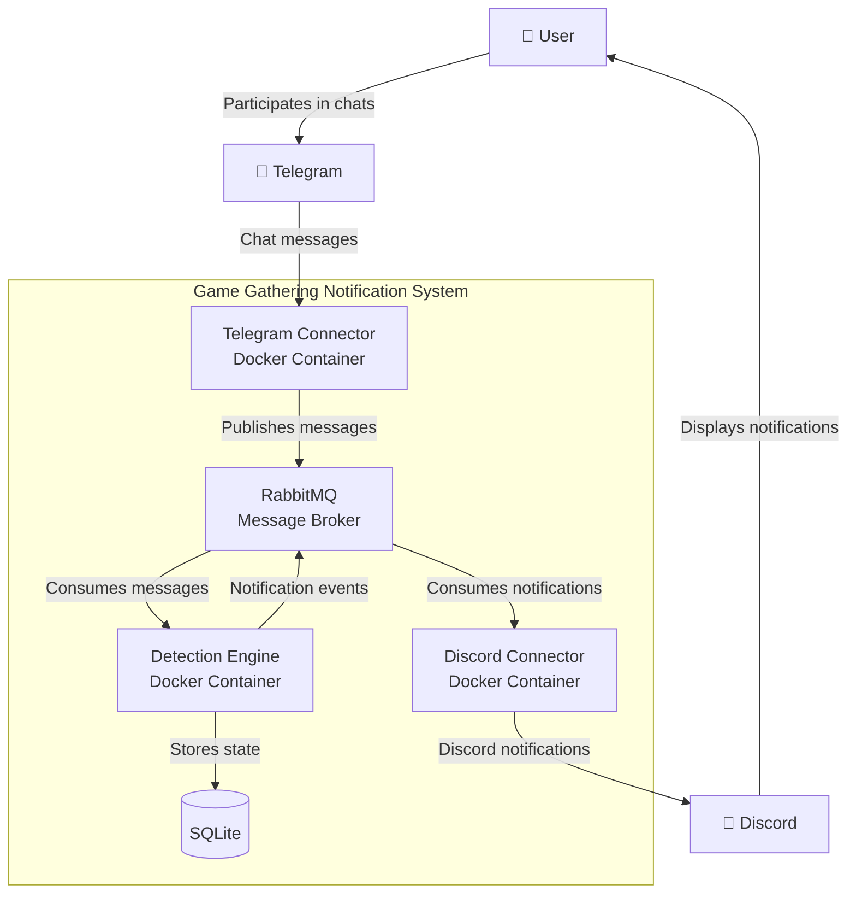

## C4 Container

```mermaid
flowchart TB

    User["👤 User"]

    Telegram["📱 Telegram"]
    Discord["💬 Discord"]

    subgraph SystemBoundary["Game Gathering Notification System"]

        TG["Telegram Connector
        Docker Container"]

        MQ["RabbitMQ
        Message Broker"]

        Core["Detection Engine
        Docker Container"]

        DS["Discord Connector
        Docker Container"]

        DB[("SQLite")]

        TG -->|"Publishes messages"| MQ

        MQ -->|"Consumes messages"| Core

        Core -->|"Stores state"| DB

        Core -->|"Notification events"| MQ

        MQ -->|"Consumes notifications"| DS

    end

    User -->|"Participates in chats"| Telegram

    Telegram -->|"Chat messages"| TG

    DS -->|"Discord notifications"| Discord

    Discord -->|"Displays notifications"| User
```