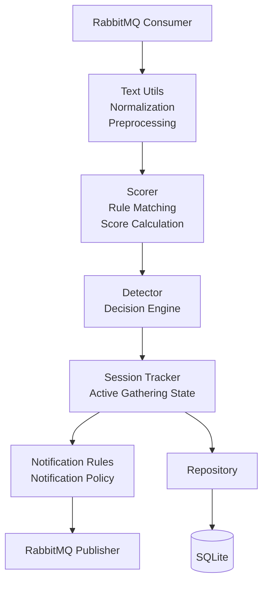

## C4 Component (Detection engine)

```mermaid
flowchart TB

    MQ["RabbitMQ Consumer"]

    TextUtils["Text Utils
    Normalization
    Preprocessing"]

    Scorer["Scorer
    Rule Matching
    Score Calculation"]

    Detector["Detector
    Decision Engine"]

    SessionTracker["Session Tracker
    Active Gathering State"]

    NotificationRules["Notification Rules
    Notification Policy"]

    Repository["Repository"]

    DB[("SQLite")]

    OutQueue["RabbitMQ Publisher"]

    MQ --> TextUtils

    TextUtils --> Scorer

    Scorer --> Detector

    Detector --> SessionTracker

    SessionTracker --> NotificationRules

    NotificationRules --> OutQueue

    SessionTracker --> Repository

    Repository --> DB
```