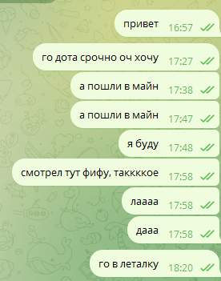
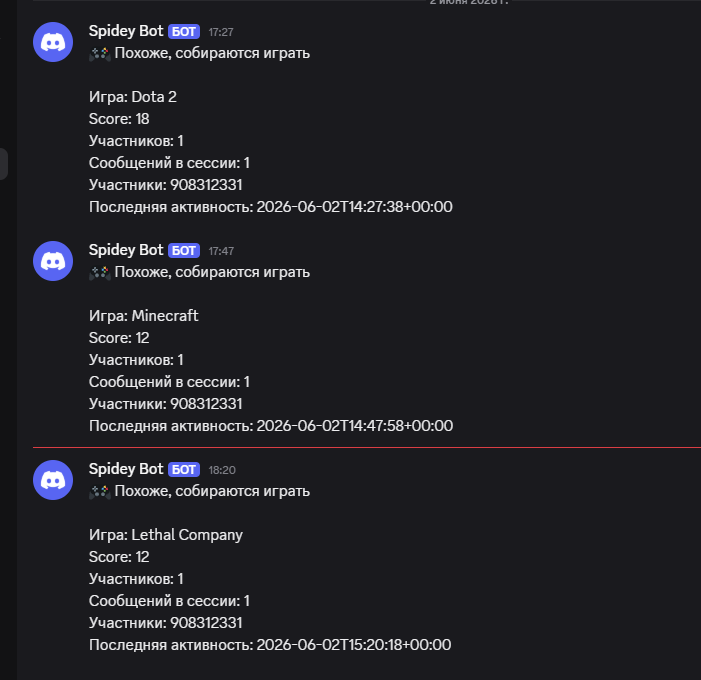
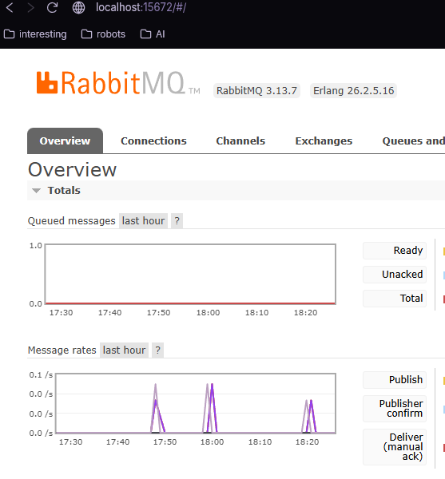
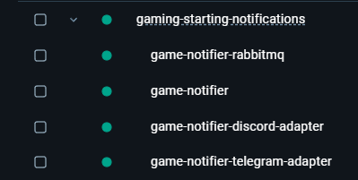

# Репозиторий
https://github.com/sergkhr/Gaming-starting-notifications/tree/master

# Используемая модель
gpt-5.5 та же что и ранее

# Описание процесса работы с ИИ
Приводить конкретные промпты крайне проблематично, сообщений было множество в разных, и карйне разнообразные

Однако можно выделить следующее:
- в промптах я писал много контекста, с целью передать ИИ максимум своих намерений, по моему опыту это увеличивает шанс того, что модель сделает то что я хочу.
- ИИ может сильно уходить в сторону, начинать теоретизировать и теряться - в результате может получиться так что мы исправляемое правильное на неправильное ради сокращения будущей работы которую до этого отменили и т.п.
- В результате предыдущего пункта и вцелом в работе приходится активно следить за тем, чтобы ИИ делал именно то что нужно и не терялся. По сути слежение за сотрудником.
- В общем -- ИИ создает хороший код и даже дает хорошие советы. В ОТЛИЧИИ ОТ ПРЕДЫДУЩИХ МОДЕЛЕЙ даже может не соглашаться с предложениями и поправлять меня когда я не понимал и ошибался. В обратную сторону тоже работало, раздражений при работе было немного.
- Есть подозрение, что минимум половина ошибок и неправильного поведения ИИ появились в результате тех или иных элементов прошлых запросов, в результате была адаптирована тактика: "как можно чаще напоминать и уточнять что именно нужно делать и с чем"

Оценить количество написанного кода ИИ можно по-разному.

В целом - все 99.9% так или иначе написал ИИ.

В работе я давал направления, и больше архитектурные решения. Поправлял структурные ошибки или запрашивал их исправление. Примеры:
- Лишняя инфомрация в .env -- убирал почти вручную, но позже рассказывал об этом ИИ
- тестовая функция выделена в папку tools - не имеет смысла - переместил

И т.п.

## Ошибки
Технических ошибок крайне мало, я даже не вспомню.

Основные ошибки можно описать как "концептуальные" или "архитектурные" -- что-то не проверяется, не обрабатывается.

Так например не было учтено, что rabbitMQ посчитает систему зависшей из-за того, что она не отвечала на heartbeat проверки, и при отправке следующего сообщения система обратилась в закрытое подключение и сломалась.

После указания на эту ошибку, а вернее просто на логи ошибки -- ИИ полностью понял, описал проблему и написал решение

Такой паттерн был на протяжении всей разработки.
> разумеется предвидение ошибки предпочтительнее, но не всегда возможно

# Работа MVP
В созданные приватный чат, пишутся сообщения, разные.

Часть из них означает приглашение на игру, другие, например, обсуждение новостей.

В результате появляются оповещения о сборах в игры, (3-е сообщение не привело к вызову -- это как раз была ошибка с мертвым соединением - исправлена)

На диаграммах RabbitMQ видно времена его активности -- собственно все временные метки совпадают друг с другом в системах.

# Схема работы микросервисов
## Контейнеры

1) RabbitMQ
2) Обработчик сообщений
3) Связь с дискордом
4) связь с телеграммом

## Последовательность
- Сообщение в чате телеграмма
- (4) получает сообщение - адаптирует его - отправляет в сообщения RabbitMQ
- (1) кладет в очередь - передает в Обработчик сообщений
- (2) принимает решение - если надо уведомить, то отправляет сообщение в RabbitMQ (если не надо отправлять то тут и заканчиваем)
- (1) кладет в очередь - передает в Связь с дискордом
- (3) адаптирует под вид для дискорда - отправляет через webhook в дискорд

# Аспекты усложнения проекта

## Множество контейнеров
В проекте 4 контейнера
1) Обработчик сообщений
2) Связь с телеграммом
3) Связь с дискордом
4) RabbitMQ

## Внешние API
- API приложения Телеграмма -- для чтения сообщений
- WebHook Discord канала -- для отправки сообщений о сборе
